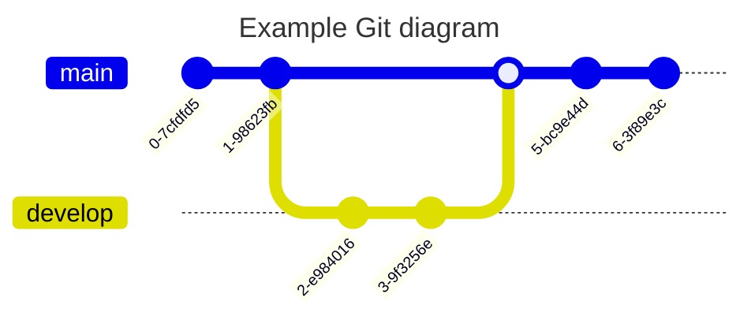

# Outline

manage Xcode versions
Great community
Apple docs aren’t great. 
Working at a big company doesn’t mean you know how to write and ship an app - custom frameworks and niches

```mermaid
---
title: Example Git diagram
---
gitGraph
   commit
   commit
   branch develop
   checkout develop
   commit
   commit
   checkout main
   merge develop
   commit
   commit
```
